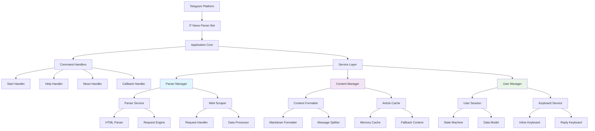

# План архитектуры

## 1. Общая архитектура системы

IT News Parser Bot - система для парсинга и распространения IT новостей через Telegram бота

## 2. Компоненты системы

### 2.1. Уровень взаимодействия с платформой
- **Telegram Platform** - Внешняя платформа мессенджера Telegram
- **IT News Parser Bot** - Основной класс бота, точка входа в систему

### 2.2. Ядро приложения (Application Core)
- **Bot Manager** - Центральный координатор, управляет жизненным циклом бота
- **Command Handlers** - Реестр обработчиков текстовых команд
- **Service Layer** - Реестр сервисов для бизнес-логики

### 2.3. Обработчики команд (Command Handlers)
- **Start Handler** - Инициализация бота, приветственное сообщение и меню
- **Help Handler** - Справочная информация и инструкции по использованию
- **News Handler** - Основной обработчик для получения и отображения статей
- **Callback Handler** - Обработчик нажатий на inline-кнопки

### 2.4. Менеджер парсинга (Parser Manager)
- **Parser Service** - Основной сервис для парсинга itproger.com
- **Web Scraper** - Веб-скрапинг HTML контента с сайта
- **HTML Parser** - Анализ и извлечение данных из HTML структуры
- **Request Engine** - Управление HTTP запросами к целевым ресурсам
- **Request Handler** - Обработка сетевых запросов и ошибок
- **Data Processor** - Обработка и валидация полученных данных

### 2.5. Менеджер контента (Content Manager)
- **Content Formatter** - Форматирование контента для Telegram
- **Article Cache** - Кэширование статей для быстрого доступа
- **Markdown Formatter** - Поддержка Markdown разметки в сообщениях
- **Message Splitter** - Разделение длинных статей на части
- **Memory Cache** - Временное хранение данных в памяти
- **Fallback Content** - Резервный контент при недоступности сайта

### 2.6. Менеджер пользователей (User Manager)
- **User Session** - Управление сессиями и состоянием пользователей
- **Keyboard Service** - Генерация интерфейсных элементов
- **State Machine** - Управление состоянием диалога с пользователем
- **Data Model** - Модели данных для хранения информации
- **Inline Keyboard** - Создание inline-кнопок для действий
- **Reply Keyboard** - Генерация reply-клавиатур для навигации

## 3. Потоки данных

### 3.1. Поток получения новостей:
Пользователь → Telegram API → News Handler → Parser Manager → Web Scraper → itproger.com

### 3.2. Поток обработки контента:
HTML контент → HTML Parser → Content Formatter → Message Splitter → Пользователь

### 3.3. Поток управления состоянием:
Действие пользователя → Callback Handler → User Manager → Генерация ответа

## 4. Ключевые особенности архитектуры

### 4.1. Модульность
Каждый компонент отвечает за конкретную задачу, что упрощает тестирование и поддержку

### 4.2. Отказоустойчивость
Система продолжает работу при недоступности itproger.com благодаря fallback-механизмам

### 4.3. Масштабируемость
Архитектура позволяет легко добавлять новые источники контента и функции

### 4.4. Производительность
Кэширование и оптимизированные запросы обеспечивают быстрый отклик системы

---

*Документация подготовлена: Спиридонова Софья (@SonyaSpirs)*
